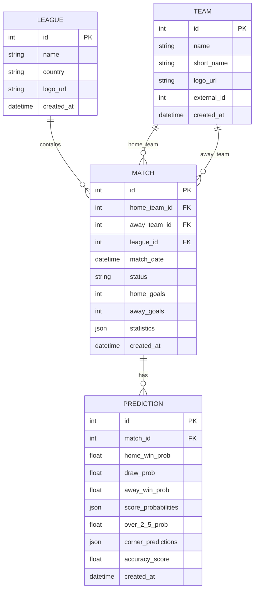

# MacAnaliz AI - Proje Gereksinimleri

## 1. Genel Bakış
MacAnaliz AI, futbol maçları için gelişmiş tahminler sunan bir yapay zeka uygulamasıdır. Takımların son performanslarını analiz ederek, maç sonuçları için güvenilir tahminler üretir.

## 2. Temel Özellikler

### 2.1 Veri Toplama ve Analiz
- Son 7 maça ait performans verileri
- Çeşitli liglerden otomatik veri çekme (Süper Lig, Serie A, La Liga, vb.)
- Manuel veri girişi desteği
- Takımlar arası geçmiş karşılaşma analizleri

### 2.2 Makine Öğrenmesi Modeli
- Denetimli Öğrenme tabanlı tahmin algoritması
- Zaman Serisi Analizi ile skor tahmini
- Takım hücum/savunma güç analizi
- İlk ve ikinci yarı için ayrı skor tahminleri

### 2.3 Tahmin Özellikleri
- **Maç Sonucu Tahmini**
  - 1 (Ev Sahibi Kazanır) / X (Beraberlik) / 2 (Deplasman Kazanır)
  - Tahmin güven skoru (0-100%)
  - Her sonuç için olasılık yüzdeleri

- **Skor Tahmini**
  - Tam skor tahmini (örn: 2-1, 1-1, 0-3)
  - En olası 3 skor senaryosu ve olasılıkları
  - İlk yarı skor tahmini
  - İkinci yarı skor tahmini

- **Özel Analizler**
  - **5+ Gol Analizi**
    - Maçta 5 veya daha fazla gol olma olasılığı
    - Her iki takımın gol ortalamaları
    - Son karşılaşmalardaki gol eğilimleri
  
  - **Beraberlik Analizi**
    - Yüksek beraberlik potansiyeli olan maçlar
    - Beraberlik olasılık yüzdeleri
    - Tarihsel beraberlik verileri

  - **Korner Tahmini**
    - Toplam korner sayısı tahmini
    - Her iki takım için ortalama korner istatistikleri
    - Yüksek korner potansiyelli maçlar

  - **Kombine Analiz**
    - 5+ gol ve beraberlik kombinasyonu
    - Skor ve korner çift tahminleri
    - Özel bahis stratejileri için analizler

### 2.4 Kullanıcı Arayüzü
- Kullanıcı dostu arayüz
- Farklı liglerden takım seçimi
- Geçmiş tahminlerin görüntülenmesi
- Tahmin doğruluk oranları

## 3. Teknik Gereksinimler

### 3.1 Ön Uç
- HTML5, CSS3, JavaScript
- React.js veya Vue.js
- Responsive tasarım

### 3.2 Arka Uç
- Python 3.8+
- Flask/Django
- RESTful API

### 3.3 Veritabanı
- PostgreSQL/MySQL
- Veri modelleme ve optimizasyon

### 3.4 Makine Öğrenmesi ve İstatistik
- **Modeller**
  - Skor Tahmini: Poisson Regresyon ve XGBoost
  - Sonuç Tahmini: Random Forest ve Lojistik Regresyon
  - Korner Tahmini: Time Series Analysis
  - 5+ Gol Tahmini: Binary Classification

- **Veri İşleme**
  - Scikit-learn ile özellik çıkarımı
  - TensorFlow/PyTorch derin öğrenme modelleri
  - Zaman serisi analizi
  - Anomali tespiti

- **Performans Metrikleri**
  - Doğruluk (Accuracy)
  - Hassasiyet (Precision) ve Duyarlılık (Recall)
  - ROC-AUC skorları
  - Brier skoru (olasılık tahminleri için)

## 4. Geliştirme Aşamaları

### 4.1 Altyapı Kurulumu
- Geliştirme ortamının hazırlanması
- Veritabanı şemasının oluşturulması
- API endpoint'lerinin tasarlanması

### 4.2 Veri Toplama ve İşleme
- Veri kaynaklarının entegrasyonu
- Veri temizleme ve ön işleme
- Özellik çıkarımı

### 4.3 Model Geliştirme
- Algoritma seçimi ve eğitimi
- Model doğrulama ve test
- Performans metriklerinin hesaplanması

### 4.4 Entegrasyon ve Test
- Frontend-Backend entegrasyonu
- Kullanıcı kabul testleri
- Performans testleri

## 5. Tahmin Metodolojisi

### 5.1 Veri Toplama ve İşleme
- **Veri Kaynakları**
  - API-Ninjas Football API
  - Football-Data.org
  - Tarihsel maç verileri
  - Takım ve oyuncu istatistikleri

- **Veri Temizleme**
  - Eksik veri analizi
  - Aykırı değer tespiti
  - Veri normalizasyonu

### 5.2 Özellik Mühendisliği
- **Temel Özellikler**
  - Son 5/10 maç performansı
  - Ev sahibi/deplasman formu
  - Takımlar arası geçmiş maçlar
  - Sakat ve cezalı oyuncular

- **Gelişmiş İstatistikler**
  - Beklenen Gol (xG) değerleri
  - Şut ve isabet oranları
  - Top hakimiyeti yüzdeleri
  - Faul ve kart istatistikleri

## 6. Kullanım Senaryoları

### 5.1 Maç Tahmini
1. Kullanıcı iki takım seçer
2. Sistem son 7 maçın istatistiklerini analiz eder
3. Tahmin sonuçları kullanıcıya sunulur

### 5.2 Beraberlik Analizi
1. Sistem yüksek beraberlik ihtimali olan maçları listeler
2. Her maç için beraberlik olasılığı gösterilir
3. Geçmiş başarı oranları paylaşılır

### 5.3 5+ Gol Analizi
1. Yüksek gol beklentili maçlar tespit edilir
2. Her iki takımın hücum gücü analiz edilir
3. 5+ gol olasılığı yüksek maçlar listelenir

## 6. Teknik Mimari ve Modül Yapısı

### 6.1 Proje Yapısı
```
macanaliz/
├── app/
│   ├── __init__.py
│   ├── models/           # Veritabanı modelleri
│   │   ├── __init__.py
│   │   ├── base.py       # Temel model sınıfı
│   │   ├── match.py      # Maç modeli
│   │   ├── team.py       # Takım modeli
│   │   ├── league.py     # Lig modeli
│   │   └── prediction.py # Tahmin modeli
│   │
│   ├── services/       # İş mantığı ve AI modelleri
│   │   ├── __init__.py
│   │   ├── api_provider.py # API sağlayıcı arayüzü
│   │   ├── api_ninjas.py   # API-Ninjas entegrasyonu
│   │   ├── football_data.py # Football-Data entegrasyonu
│   │   └── prediction_engine.py # Tahmin motoru
│   │
│   ├── routes/         # API endpoint'leri
│   │   ├── __init__.py
│   │   ├── predictions.py # Tahmin endpoint'leri
│   │   └── teams.py       # Takım endpoint'leri
│   │
│   ├── static/         # Statik dosyalar (CSS, JS)
│   └── templates/       # HTML şablonları
│
├── config.py           # Yapılandırma ayarları
├── requirements.txt     # Bağımlılıklar
├── run.py              # Uygulama giriş noktası
└── data/               # Eğitim verileri ve modeller
```

### 6.2 Veritabanı Şeması



### 6.3 Ana Bağımlılıklar

#### Backend Bağımlılıkları
```python
# requirements.txt
Flask==2.3.3
Flask-SQLAlchemy==3.1.1
Flask-Migrate==4.0.5
Flask-Login==0.6.2
Flask-Cors==4.0.0
python-dotenv==1.0.0
requests==2.31.0
pandas==2.0.3
numpy==1.24.3
scikit-learn==1.3.0
joblib==1.3.2
xgboost==1.7.6
python-dateutil==2.8.2
psycopg2-binary==2.9.7
SQLAlchemy==2.0.20
```

#### Makine Öğrenmesi Modülleri
- `scikit-learn`: Temel ML algoritmaları ve veri işleme
- `xgboost`: Gradient Boosting tabanlı sınıflandırma ve regresyon
- `joblib`: Model serileştirme ve yükleme
- `pandas`: Veri işleme ve analiz
- `numpy`: Sayısal işlemler

### 6.4 API Endpoint'leri

#### Tahmin İstekleri
- `GET /api/predict?home_team=<id>&away_team=<id>`: Maç tahmini yapar
- `GET /api/predict/draws?league_id=<id>`: Yüksek beraberlik ihtimalli maçları listeler
- `GET /api/predict/high-scoring`: Yüksek gol ihtimalli maçları listeler

#### Takım ve Maç Bilgileri
- `GET /api/teams`: Tüm takımları listeler
- `GET /api/teams/<id>/matches`: Takımın maçlarını listeler
- `GET /api/leagues`: Tüm ligleri listeler

### 6.5 Çalıştırma Talimatları

1. Sanal ortam oluşturma ve aktif etme:
```bash
python -m venv venv
source venv/bin/activate  # Linux/Mac
.\venv\Scripts\activate  # Windows
```

2. Gerekli paketleri yükleme:
```bash
pip install -r requirements.txt
```

3. Veritabanı başlatma:
```bash
flask db init
flask db migrate -m "Initial migration"
flask db upgrade
```

4. Uygulamayı çalıştırma:
```bash
python run.py
```

## 7. Gelecek Güncellemeler
- Canlı maç analizleri
- Oyuncu bazlı istatistikler
- Daha fazla lig ve turnuva desteği
- Mobil uygulama entegrasyonu
